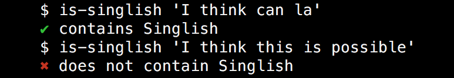

# is-singlish-cli [](https://travis-ci.org/dvrylc/is-singlish)

> Check whether a string contains Singlish phrases



## Install
```
$ npm install --global is-singlish-cli
```

## Usage
```
$ is-singlish --help

  Check whether a string contains Singlish phrases

  Usage
    $ is-singlish <string>

  Examples
    $ is-singlish 'I think can la'
    ✔ contains Singlish
    $ is-singlish 'I think this is possible'
    ✖ does not contain Singlish
  
  Exits with code 1 on error
```

## Related
- [is-singlish](https://github.com/dvrylc/is-singlish) - API for this module

## License
MIT © [Daryl Chan](https://darylchan.net)
